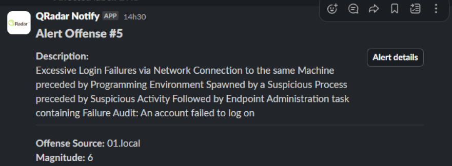

### QRadar Notify
This script is designed to integrate IBM QRadar with Slack by notifying Slack channels about offenses with a magnitude greater than 5. Notifications include the offense description, source, and a direct link to the offense details in QRadar.



Features
--------

*   Fetch open offenses from QRadar.
    
*   Notify Slack via webhook for offenses with a magnitude greater than 5.
    
*   Avoid duplicate notifications by leveraging QRadar reference sets.
    
*   Includes offense details in a Slack-friendly format with direct links to QRadar.
    

Prerequisites
-------------

*   **Python**: Version 3.6 or later.
    
*  **Libraries**: `requests`, `urllib3`.  
    
*   **QRadar**: Active QRadar instance with API access.
    
*   **Slack**: Configured Slack webhook URL.
    

Setup
-----

1.  Download the script qradarNotify.py .
    
2.  Configure the following constants in the script:
    
    *   SLACK\_WEBHOOK\_URL: Replace with your Slack webhook URL.
        
    *   QRADAR\_SEC\_TOKEN: Your QRadar API security token.
        
    *   QRADAR\_URL\_BASE: Base URL of your QRadar instance.
        
    *   REFERENCE\_SET\_ID: Reference set ID used to track notified offenses.
        
3.  Disable SSL verification warnings (optional): The script suppresses SSL warnings to handle self-signed certificates. If necessary, you can enable them by removing:
```python
urllib3.disable_warnings(urllib3.exceptions.InsecureRequestWarning)
```
    

How to Use
----------

1. **Execute**
```bash
python qradarNotify.py
```
    
2.  **What it does**:
    
    *   Fetches open offenses from QRadar.
        
    *   Compares offenses with previously notified ones.
        
    *   Sends a Slack notification for new offenses with a magnitude > 5.
        
    *   Adds the notified offense ID to the reference set in QRadar to prevent duplicates.
        

Slack Notification Format
-------------------------

A Slack notification includes:

*   **Header**: "Alert Offense #ID"
    
*   **Description**: Offense details.
    
*   **Source**: Offense source.
    
*   **Level**: Magnitude level.
    
*   **Action Button**: Direct link to the offense in QRadar.
    

Code Overview
-------------

### Functions

1.  **send\_notification\_to\_slack** Sends a formatted notification to a Slack channel.
    
2.  **get\_offenses** Fetches open offenses from QRadar.
    
3.  **get\_notified\_offenses** Retrieves previously notified offenses from QRadar.
    
4.  **post\_notified\_offenses** Adds offense IDs to the QRadar reference set to avoid duplicate notifications.
    
5.  **main** Main function to orchestrate the fetching, processing, and notifying logic.
    

Notes
-----
*   You can install the script as a cron task so that it runs every 15 minutes.
```bash
chmod 755 /opt/qradar/bin/qradarNotify.py
crontab -e
*/15 * * * * /usr/bin/python /opt/qradar/bin/qradarNotify.py
````
*   Ensure SLACK\_WEBHOOK\_URL, QRADAR\_SEC\_TOKEN, QRADAR\_URL\_BASE, and REFERENCE\_SET\_ID are configured correctly before running the script.
       
*   Adjust the magnitude threshold (magnitude > 5) in the main function as needed.
    

License
-------

This script is distributed as-is under the MIT License.

For further improvements or contributions, feel free to fork and modify the script!
